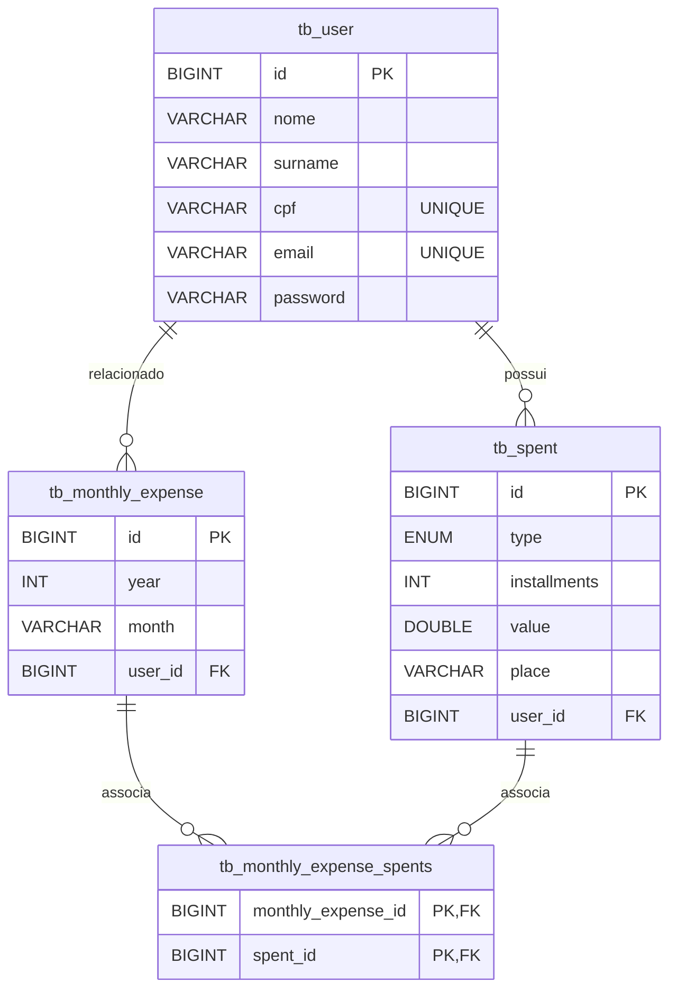

# 🚧 SmartCash - API em Desenvolvimento 🚧

Este repositório contém a API do **SmartCash**, um sistema de controle financeiro pessoal. A aplicação ainda está em fase de desenvolvimento ativo, e mudanças podem ocorrer com frequência.

---

## 🧰 Tecnologias Principais

- **Spring Boot 3.4.4** - Framework principal para construção da API.
- **Spring Data JPA** - Abstração poderosa para persistência com banco de dados.
- **MySQL** - Banco de dados relacional utilizado no ambiente local.
- **Flyway** - Controle de versionamento de migrações no banco de dados.
- **Spring Security** (em desenvolvimento) - Para futura implementação de autenticação/autorizacão segura.
- **Swagger/OpenAPI 3** - Documentação interativa da API, acessível via navegador.

---

## 🗄️ Migrations com Flyway

As migrações SQL são aplicadas automaticamente ao subir a aplicação. As versões estão localizadas em:  
`src/main/resources/db/migration`

---

## 🚀 Como executar localmente

```bash
# Clonar o repositório
git clone https://github.com/Fioshi/java-spring-smartCash.git
cd SmartCash

# Build do projeto
./mvnw clean install

# Rodar a aplicação
./mvnw spring-boot:run
```

Certifique-se de que o MySQL está rodando e o banco está configurado corretamente no `application.properties`.

---

## Diagrama do Banco de Dados



## 🔗 Endpoints

### 📅 Criar novo usuário

**POST** `/api/user/cadastro`

Cria um novo usuário no sistema.

#### Requisição

```json
{
  "name": "Carlos",
  "surname": "Medeiros",
  "cpf": "98765432100",
  "email": "carlos.m@example.com",
  "password": "seguraEssa"
}

```

#### Respostas esperadas

-   `201 Created`: Usuário criado com sucesso.

-   `400 Bad Request`: Dados inválidos ou CPF/email já cadastrados.


----------

### 📅 Criar novo gasto

**POST** `/api/spent`

Cadastra uma nova transação de gasto para um usuário.

#### Requisição

```json
{
  "idUser": 1,
  "typeSpent": "PIX",
  "value": 99,
  "place": "VIVO",
  "item": "Internet",
  "isMonthly": "TRUE"
}

```

#### Respostas esperadas

-   `201 Created`: Gasto registrado com sucesso.

-   `400 Bad Request`: Dados inválidos ou campos obrigatórios ausentes.


----------

### 📄 Listar transações por usuário

**GET** `/api/spent/transactions?userId=1`

Retorna todas as transações registradas por um usuário específico.

#### Respostas esperadas

-   `200 OK`: Lista de transações.

-   `404 Not Found`: Usuário não encontrado.


----------

### 📄 Resumo mensal de transações

**GET** `/api/spent/transactions/resume?userId=1&month=JUNE&year=2025`

Retorna o resumo das transações de um determinado mês e ano.

#### Respostas esperadas

-   `200 OK`: Resumo das transações.

-   `404 Not Found`: Nenhum dado encontrado para os filtros fornecidos.

### 📄 Detalhes de uma transação

**GET** `/api/spent/transactions/detail?userId=1&spentId=2`

Retorna os detalhes de uma transação específica de um usuário.

#### Respostas esperadas

-   `200 OK`: Detalhes da transação.

-   `404 Not Found`: Gasto ou usuário não encontrado.
